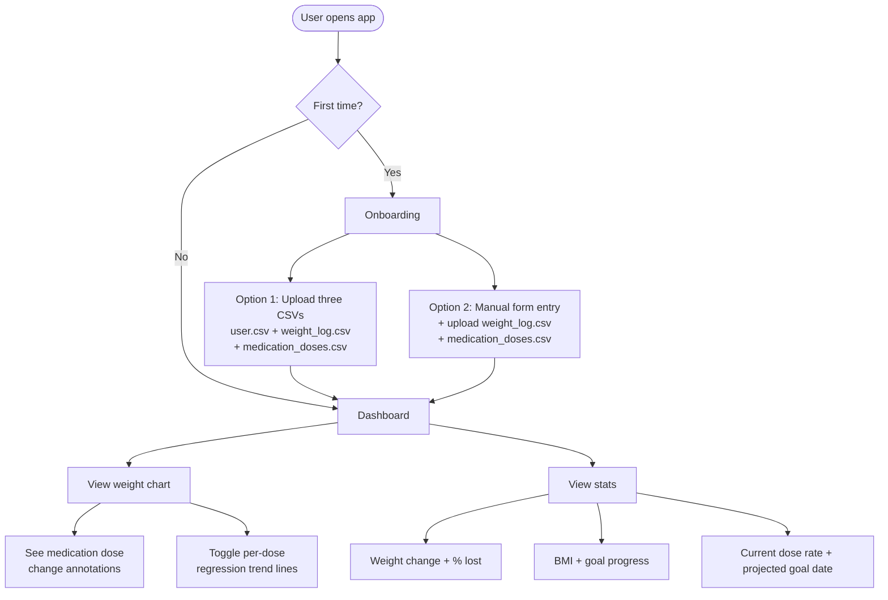

# Weight Tracker

[](https://github.com/LFairbairn/weight-tracker/actions/workflows/ci.yml)

A personal weight tracking app with medication dose overlay — visualise how medication adjustments correlate with weight loss over time.

---

## Features

- Import historic weight data via CSV upload
- Visualise weight over time with medication dose change annotations
- Per-dose linear regression trend lines with R² fit scores
- Stat cards: starting weight, current weight, total change, % lost, BMI, weekly average, to goal, current dose rate, projected goal date
- First-time onboarding flow: enter your details, upload your data, see your dashboard

**Future enhancements (not in current scope):**
- Manual add/edit weight log form — in a fully commercial product this would be a core feature; currently users add entries via CSV re-upload

---

## Tech Stack

| Layer | Technology |
|---|---|
| Backend | Python + FastAPI |
| Database | PostgreSQL |
| Frontend | React |
| Charting | ApexCharts (react-apexcharts) |
| Infrastructure | Docker + Docker Compose |
| CI/CD | GitHub Actions |
| Backend Testing | pytest |
| Frontend Testing | Vitest + React Testing Library |

---

## Architecture


---

## User Flow



---

## Project Structure

```
weight-tracker/
├── backend/
│   ├── Dockerfile
│   └── ...
├── frontend/
│   ├── Dockerfile
│   └── ...
├── docker-compose.yml
├── .github/
│   └── workflows/
│       └── ci.yml
└── README.md
```

---

## Data Model

| Table | Fields |
|---|---|
| `users` | id, name, height, target_weight, weight_unit (kg/lbs/st), measurement_unit (cm/inches), created_at |
| `weight_logs` | id, user_id, date, weight_kg, notes |
| `medications` | id, user_id, name, start_date |
| `medication_doses` | id, medication_id, dose, unit (mg/ml), date_changed |

> All measurements stored internally in base units (kg, cm). Display units are converted at the app layer based on user preference.

---

## API Endpoints

### Users
| Method | Endpoint | Description |
|---|---|---|
| GET | `/api/users/me` | Get current user profile |
| PUT | `/api/users/me` | Update height, units (kg/lbs), target weight |

### Weight Logs
| Method | Endpoint | Description |
|---|---|---|
| GET | `/api/weight` | Paginated weight history |
| POST | `/api/weight` | Log a new weight entry |
| PUT | `/api/weight/{id}` | Edit an entry |
| DELETE | `/api/weight/{id}` | Remove an entry |

### Medications
| Method | Endpoint | Description |
|---|---|---|
| GET | `/api/medications` | List all medications |
| POST | `/api/medications` | Add a new medication |
| PUT | `/api/medications/{id}` | Update medication name/notes |
| DELETE | `/api/medications/{id}` | Remove a medication |
| POST | `/api/medications/{id}/doses` | Log a dose change |
| GET | `/api/medications/{id}/doses` | Get dose history |

### Stats & Trends
| Method | Endpoint | Description |
|---|---|---|
| GET | `/api/stats/summary` | Current weight, BMI, total lost, % to goal |
| GET | `/api/stats/trend` | Linear regression projection + R² score |
| GET | `/api/stats/chart` | Combined chart payload (weights + dose markers + trend line) |

---

## Authentication & Multi-User

**Stage 1 (current):** Single-user, no authentication required. The app works immediately on open — no sign-up, no login screen. Data is stored in a self-hosted Postgres instance. Device backups (iOS/Android) handle data persistence across phone upgrades.

**Stage 2 (future consideration):** If opened to other users, authentication could be added at that point. The data model is designed to support this — every table includes a `user_id` field — but no auth system will be built in Stage 1.

---

## Getting Started

> Setup instructions will be added as the project is built out.
