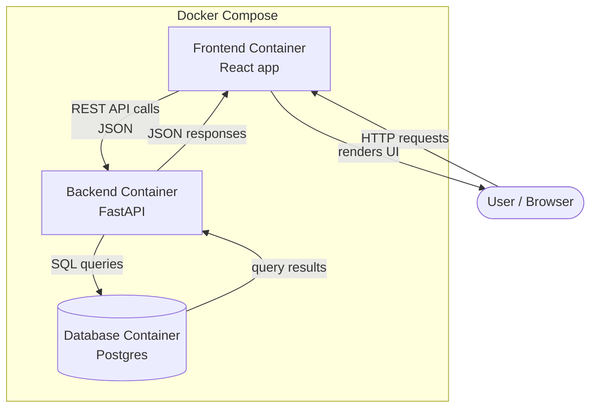
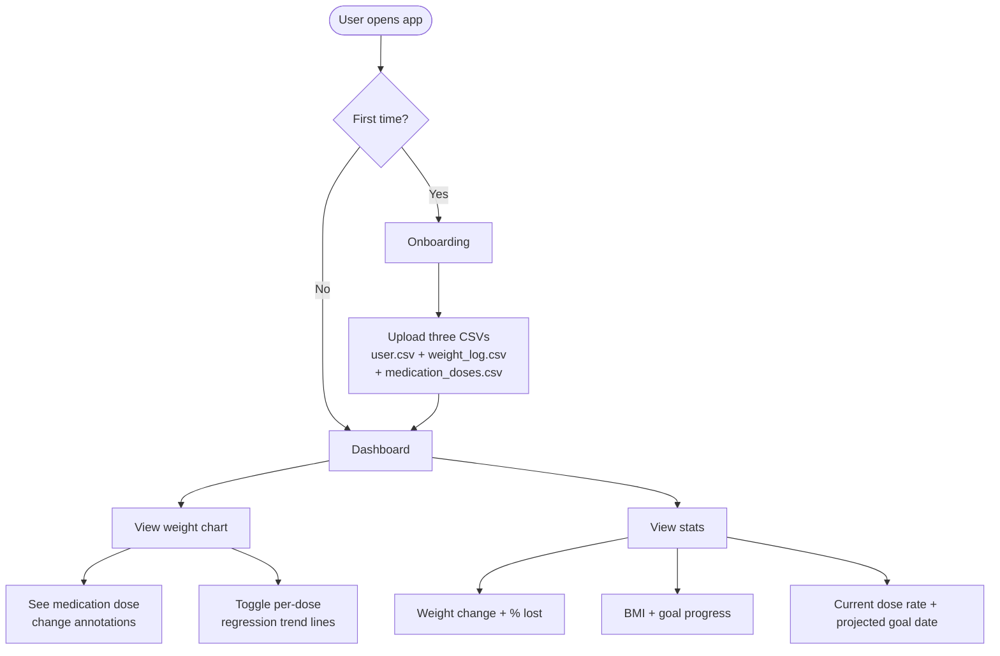

# Weight Tracker

[](https://github.com/LFairbairn/weight-tracker/actions/workflows/ci.yml)

A personal weight tracking app with medication dose overlay — visualise how GLP-1 medication adjustments correlate with weight loss over time.

---

## Screenshots

**Alex — Wegovy, 52 weeks, reaches goal weight**


**Sam — Wegovy plateau, switches to Mounjaro**


---

## Features

- First-time onboarding: upload three CSVs (user profile, weight log, medication doses) to populate your dashboard
- Weight chart with medication dose change annotations
- Per-dose linear regression trend lines with R² fit scores — see your rate of loss at each dose
- Stat cards: start date, starting weight, latest weight, goal weight, total change, % lost, BMI, weekly average, rate on current dose, projected goal date
- Toggle trend lines and weight line on/off independently
- Reset data and re-upload at any time

---

## Tech Stack

| Layer | Technology |
|---|---|
| Backend | Python + FastAPI |
| Database | PostgreSQL |
| Frontend | React |
| Charting | ApexCharts (react-apexcharts) |
| Infrastructure | Docker + Docker Compose |
| CI/CD | GitHub Actions |
| Backend Testing | pytest (38 tests, 97% coverage) |
| Frontend Testing | Vitest + React Testing Library |

---

## Getting Started

**Prerequisites:** Docker and Docker Compose

```bash
git clone https://github.com/LFairbairn/weight-tracker.git
cd weight-tracker
docker compose up --build
```

Open [http://localhost:5173](http://localhost:5173) in your browser.

On first load you'll see the onboarding screen. Upload your CSV files to populate the dashboard. Example data is provided in `example-data/` if you want to explore the app straight away.

---

## Example Data

Two example datasets are included in `example-data/`:

| Dataset | Description |
|---|---|
| `user-a-wegovy/` | Alex — 52 weeks on Wegovy, progressing from 0.25mg to 2.4mg, reaches goal weight |
| `user-b-mounjaro-switch/` | Sam — Wegovy plateau at 0.25mg/0.5mg, switches to Mounjaro, strong response |

Each folder contains `user.csv`, `weight_log.csv`, and `medication_doses.csv`.

---

## CSV Format

**user.csv**
```
name,height_cm,target_weight_kg
Alex,168,68
```

**weight_log.csv**
```
date,weight_kg
2025-01-08,92.1
2025-01-15,91.3
```

**medication_doses.csv**
```
medication_name,dose,unit,date_changed
Wegovy,0.25,mg,2025-01-08
Wegovy,0.5,mg,2025-02-19
```

---

## Architecture



---

## User Flow



---

## Project Structure

```
weight-tracker/
├── backend/
│   ├── app/
│   │   ├── models/
│   │   ├── routers/
│   │   ├── schemas/
│   │   ├── deps.py
│   │   ├── database.py
│   │   └── main.py
│   ├── tests/
│   ├── alembic/
│   └── Dockerfile
├── frontend/
│   ├── src/
│   │   └── components/
│   └── Dockerfile
├── example-data/
├── docker-compose.yml
└── .github/workflows/ci.yml
```

---

## Data Model

| Table | Fields |
|---|---|
| `users` | id, name, height, target_weight, weight_unit, measurement_unit, created_at |
| `weight_logs` | id, user_id, date, weight_kg, notes |
| `medications` | id, user_id, name, start_date |
| `medication_doses` | id, medication_id, dose, unit, date_changed |

---

## API Endpoints

### Users
| Method | Endpoint | Description |
|---|---|---|
| GET | `/api/users/me` | Get current user profile |
| PATCH | `/api/users/me` | Update height or target weight |

### Weight Logs
| Method | Endpoint | Description |
|---|---|---|
| GET | `/api/weight-logs` | List all weight logs |
| POST | `/api/weight-logs` | Create a weight log entry |
| GET | `/api/weight-logs/{id}` | Get a single entry |
| PATCH | `/api/weight-logs/{id}` | Update an entry |
| DELETE | `/api/weight-logs/{id}` | Delete an entry |

### Medications
| Method | Endpoint | Description |
|---|---|---|
| GET | `/api/medications` | List all medications |
| POST | `/api/medications` | Add a medication |
| GET | `/api/medications/{id}` | Get a medication |
| PATCH | `/api/medications/{id}` | Update a medication |
| GET | `/api/medications/{id}/doses` | List dose history |
| POST | `/api/medications/{id}/doses` | Log a dose change |
| PATCH | `/api/medications/{id}/doses/{dose_id}` | Update a dose |
| DELETE | `/api/medications/{id}/doses/{dose_id}` | Delete a dose |

### Stats
| Method | Endpoint | Description |
|---|---|---|
| GET | `/api/stats` | Per-dose linear regression (slope, R²) and overall trend |

### Upload
| Method | Endpoint | Description |
|---|---|---|
| POST | `/api/upload/user` | Upload user.csv |
| POST | `/api/upload/weight-logs` | Upload weight_log.csv |
| POST | `/api/upload/medication-doses` | Upload medication_doses.csv |
| POST | `/api/upload/reset` | Wipe all data and return to onboarding |

---

## Authentication & Multi-User

**Stage 1 (current):** Single-user, no authentication required. The app works immediately on open — no sign-up, no login screen. Data is stored in a self-hosted Postgres instance.

**Stage 2 (future consideration):** The data model is designed to support multiple users — every table includes a `user_id` field — but no auth system will be built in Stage 1.
